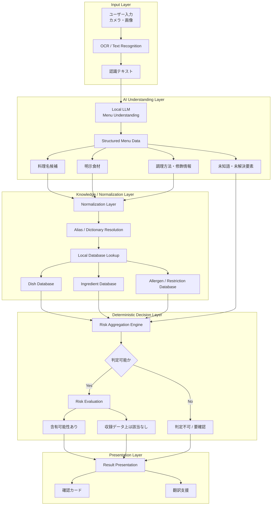

# Meelyze 技術選定

> **Status**: Accepted
> **対象**: MVP
> **関連Issue**: #3

## 1. 設計方針

Meelyzeでは、OCRで取得したメニュー文字列をDBへ完全一致させるだけでなく、ローカルLLMを利用してメニューの意味解析を行う。LLMの主な責務は次のとおりとする。

- メニュー項目の分割
- ベース料理名の抽出
- 明示された食材の抽出
- 調理方法の抽出
- 修飾表現の分離
- 複合料理名・造語の意味解析
- 未知語・未解決要素の抽出
- 正規化候補の生成

ただし、LLMの出力をそのまま最終的なアレルゲン・食事制限判定には使用しない。責務分担の基本原則は以下とする。

```text
LLM = 自然言語の理解・分解

DB = 料理・食材に関する既知情報

Rule Engine = 最終的な判定
```

最終判定は、DBとSwiftによる決定論的なロジックで実施する。LLMによる推論は非対称に扱い、安全側へ倒す。

- LLMが「含まれる可能性」を示した場合、警告側のEvidenceとして利用できる
- LLMが「含まれない」と推論した結果は、安全側の判定根拠として単独では使用しない
- 解決できない要素が存在する場合は「判定不可 / 要確認」とする

Meelyzeの要件である「**誤って安全と言わない**」ことを最優先とする。

## 2. 全体アーキテクチャ



## 3. 採用技術

| 領域 | 採用技術 | 用途 |
|---|---|---|
| 開発言語 | Swift | iOSアプリ全体 |
| UI | SwiftUI | 画面構築 |
| Architecture | MVVM + Repository / Service | 責務分離 |
| Camera | AVFoundation | メニュー撮影 |
| OCR | Apple Vision | 日本語文字認識 |
| Local LLM 第一候補 | Apple Foundation Models | メニュー意味解析 |
| Local LLM 代替候補 | llama.cpp | 独自軽量モデル利用時 |
| LLM抽象化 | `MenuUnderstandingService` | LLM実装差し替え |
| LLM出力 | Structured Output | メニュー解析結果の型安全な取得 |
| Normalization | Swift独自ロジック | 表記統一 |
| Alias Dictionary | SwiftData | 同義語・方言・表記揺れ解決 |
| Local Database | SwiftData | 料理・食材・アレルゲン情報 |
| 初期データ | JSON | Git管理・初回インポート |
| 判定処理 | Swift Rule Engine | 決定論的な三値判定 |
| 翻訳 | Apple Translation Framework | 店員との翻訳支援 |
| HTTP | URLSession | 将来のオンライン通信 |
| Profile Storage | SwiftData | アレルギープロファイル保存 |
| Secret Storage | Keychain | APIキー等の秘密情報 |
| Unit Test | Swift Testing | 判定・正規化・解析テスト |
| UI Test | XCTest / XCUITest | UI・E2Eテスト |
| Package Manager | Swift Package Manager | 依存関係管理 |

### 3.1 選定理由と候補比較

| 領域 | 採用理由 | 主な代替候補と不採用理由 |
|---|---|---|
| Swift / SwiftUI | Appleの端末内AI、Vision、Translation、SwiftDataとの統合が直接的で、MVPのiOS開発に適する | Flutterはクロスプラットフォーム性に優れるが、MVPではApple固有APIとの統合と検証速度を優先する |
| MVVM + Repository / Service | UI状態、ユースケース、外部技術を分離でき、判定ロジックを単体テストしやすい | Viewから各Frameworkを直接利用する構成は依存が密になり、差し替えとテストが難しい |
| Apple Vision | 端末内で日本語OCRを実行でき、画像を外部送信せずに済む | 外部OCR APIは通信、費用、プライバシー上の制約が増える |
| Foundation Models | オンデバイスで構造化された自然言語理解を行え、Appleプラットフォームとの統合性が高い | llama.cppは端末・モデル要件の検証負荷が高いため代替候補とする |
| SwiftData | Swiftの型と統合しやすく、MVPのローカル永続化を簡潔に実装できる | SQLite直接利用は検索や移行を細かく制御できるが、MVPでは実装量が増える |
| JSON初期データ | レビューしやすくGitで差分管理でき、SwiftDataへ一貫して投入できる | CSVは表形式編集に強いが、関連や属性を持つデータではJSONのほうが表現しやすい |

## 4. アプリケーションアーキテクチャ

MVVM + Repository / Serviceを採用する。SwiftUIの表示・状態管理と、OCR、LLM、永続化、判定の各責務を分離し、実装の交換と単体テストを容易にするためである。

```text
SwiftUI View
    ↓
ViewModel
    ↓
UseCase / Service
    ↓
Repository
```

メニュー解析では以下の責務分離を基本とする。

```text
ScanView
    ↓
ScanViewModel
    ↓
MenuAnalysisService
    ├── OCRService
    ├── MenuUnderstandingService
    ├── NormalizationService
    ├── DishRepository
    ├── IngredientRepository
    └── RiskEvaluationService
```

ViewModelからVision、Foundation Models、SwiftDataなどの具体実装を直接呼び出さない。各FrameworkはProtocolに準拠したServiceまたはRepositoryの実装内へ閉じ込める。

## 5. OCR

OCRにはApple Visionを採用し、端末内で日本語文字認識を行う。OCRの責務は次の範囲に限定する。

```text
画像
↓
OCR
↓
認識文字列
```

OCR自体には料理の意味解釈やアレルゲン判定を行わせない。認識できない文字列や信頼度の低い結果は後段へ明示的に渡し、「判定不可」へ倒せるようにする。

## 6. Local LLM

第一候補としてApple Foundation Modelsを採用する。用途は、アレルゲンの最終判定ではなく、メニューの自然言語理解と構造化である。可能な限り自由文章を返させず、次のような構造化データとして取得する。

```swift
struct ParsedMenuItem {
    var originalText: String
    var baseDishCandidates: [String]
    var explicitIngredients: [String]
    var preparationMethods: [String]
    var modifiers: [String]
    var unknownTerms: [String]
}
```

Foundation Models固有の処理へアプリ全体が依存しないよう、抽象化を設ける。

```swift
protocol MenuUnderstandingService {
    func parse(text: String) async throws -> ParsedMenuItem
}
```

```text
MenuUnderstandingService
    ├── FoundationModelsMenuParser
    └── LlamaCppMenuParser
```

MVPでは`FoundationModelsMenuParser`を優先して検証する。Apple Foundation Modelsが対象端末で利用できない場合や、将来的に独自の蒸留・量子化モデルを使用する場合に備え、`LlamaCppMenuParser`へ差し替え可能な構成にする。利用可否を実行時に確認し、利用できず代替実装もない場合は推測せず「判定不可」とする。

## 7. Normalization / Alias

LLMの出力をDB上の正規データとして直接信用しない。次の順序で正規化と解決を行う。

```text
LLM解析結果
↓
Normalization
↓
Alias Dictionary
↓
Canonical Entity
```

Normalizationでは少なくとも以下を考慮する。

- 全角・半角
- 空白
- ひらがな・カタカナ
- 長音
- OCR表記揺れ
- 方言
- 別名
- ブランド名
- 商品名

変換前の文字列、適用した変換、解決先をEvidenceとして追跡できるようにする。複数候補を一意に解決できない場合は未知・未解決要素として扱う。

## 8. Local Database

ローカルデータベースにはSwiftDataを採用し、以下の情報を分離して管理する。

```text
Dish
DishAlias
Ingredient
IngredientAlias
Allergen
Restriction
UserProfile
```

特に`Dish`と`Ingredient`を分離し、料理に関する知識と食材の属性を独立して更新できるようにする。

### 8.1 Dish Database

料理そのものに関する知識を保持する。料理名に現れない次のような「隠れ食材」も管理できる構造とする。

- だし
- ラード
- 調味料
- 酒類
- その他、調理過程で使用される食材

### 8.2 Ingredient Database

食材の標準名と属性を管理する。

```text
Ingredient
├── canonicalName
├── aliases
├── allergens
├── porkDerived
├── animalDerived
└── alcoholRelated
```

初期マスターデータはJSONとしてGit管理し、アプリ初期化時に検証したうえでSwiftDataへ読み込む。スキーマバージョンとデータバージョンを持たせ、重複インポートを防止する。

## 9. Risk Aggregation / Evidence

LLM解析結果、Dish DB、Ingredient DBを統合して判定する`Risk Aggregation Engine`を設ける。判定結果だけでなく、ユーザーへの根拠表示と監査・テストに利用できるEvidenceを保持する。

```swift
enum EvidenceSource {
    case explicit
    case normalized
    case dishDatabase
    case llmInference
    case unknown
}
```

| Evidence | 意味 |
|---|---|
| `explicit` | メニュー文字列に直接記載されていた情報 |
| `normalized` | Alias Dictionaryによって正規化された情報 |
| `dishDatabase` | 既知料理のDBから得られた情報 |
| `llmInference` | LLMによる意味的推論。Positiveな推論のみ警告方向に利用できる |
| `unknown` | 未知語、曖昧な候補など、解決できなかった情報 |

## 10. 最終判定

最終判定はLLMではなくSwiftの決定論的なRule Engineで実施し、次の三値を維持する。

```text
含有の可能性が高い
収録データ上は該当なし
判定不可
```

### 10.1 含有の可能性が高い

DBまたは十分なEvidenceから、対象食材の含有可能性が確認できる場合に使用する。LLMによるPositiveな推論は、警告方向のEvidenceとして利用できる。

### 10.2 収録データ上は該当なし

DB上の既知情報を十分に確認でき、未知・未解決要素が残っていない場合のみ使用できる。LLMによるNegativeな推論だけを根拠として使用してはならない。この表現は安全の保証ではなく、店員への確認導線を常に提示する。

### 10.3 判定不可

以下のいずれかに該当する場合は「判定不可」とし、店員への確認を促す。

- 未知語が残っている
- DBで解決できない要素が存在する
- 十分なEvidenceが得られない
- LLM解析結果とDB情報に矛盾がある

## 11. 翻訳

Apple Translation Frameworkを採用し、以下に使用する。

- 店員向け確認カード
- ユーザー母語から日本語への翻訳
- 日本語からユーザー母語への翻訳

定型確認カードは可能な限りローカルデータとして保持し、オフラインでも利用できる構成とする。翻訳結果にはアレルゲンの可否判断を生成させず、翻訳と確認支援の責務に限定する。

## 12. 対応環境・依存関係

### 12.1 対応iOSバージョン

MVPの最低対応バージョンは、Apple Foundation Modelsを第一候補として利用できるOSバージョンに合わせ、実装開始時にXcode SDKと対象端末で確定する。Foundation Modelsの利用可否はOSバージョンだけでなく端末能力やユーザー設定にも依存し得るため、コンパイル時のAvailabilityチェックと実行時の利用可否チェックを行う。

最低対応OSの確定前でも、`MenuUnderstandingService`による抽象化により非対応環境を安全に扱う。非対応端末では代替Parserを使用し、利用可能なParserがなければ未知要素を「判定不可」とする。

### 12.2 対象端末での検証

所有するiPhone実機で、以下を検証して採用構成の実行可能性を確認する。

- Apple Visionによる日本語OCRの精度と処理時間
- Foundation Modelsの利用可否、構造化出力、処理時間、メモリ使用量
- CPU、GPU、Neural Engine使用時の発熱と連続実行時の安定性
- SwiftDataの初期データ投入時間と検索性能
- オフライン状態でのOCR、DB照合、判定、確認カード表示
- Foundation Models非対応時のフォールバックと「判定不可」への遷移

### 12.3 外部ライブラリとライセンス

MVPの第一候補構成はApple標準Frameworkのみで実装し、外部ライブラリへの依存を持たない。Apple各FrameworkはApple Developer Program License Agreementおよび各SDKの利用条件に従う。

llama.cppを採用する場合はSwift Package Managerで依存を固定し、導入時点のライセンス、モデル本体のライセンス、配布条件、NOTICE表記を別途確認する。モデルのライセンスはランタイムのライセンスとは独立して確認し、確認が完了するまでアプリへ同梱しない。

## 13. 要件定義との関係

本資料はIssue #3でAcceptedとなったMVPの技術選定を記録する。`docs/requirements.md`に記載されたFlutter、SQLite、外部AI APIを前提とする旧技術制約と本資料が競合する場合、MVPの実装技術については本資料を最新の決定として扱う。安全原則、三値判定、オフライン要件、プライバシー要件は引き続き維持する。

要件定義そのものの制約記述は、別Issueで本決定と整合させる。
