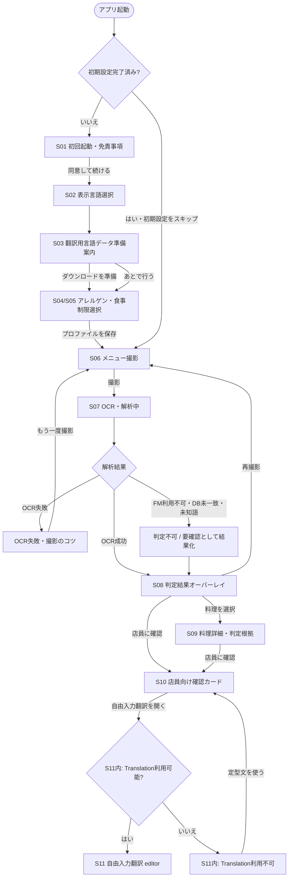

# Meelyze MVP UI設計

> Status: Ready for review（TASK-008〜TASK-011統合済み、上位仕様差分はProduct Owner決定により解消済み。PR作成・外部レビュー・mainマージ待ち）
> Last updated: 2026-08-16

本書は、Issue #10で確定するMVPの画面責務、画面遷移、表示状態、共通UI方針を統合したレビュー用文書である。下記の上位仕様差分はProduct Owner（@naga-T28）が2026-08-16に決定済みであり、mainへマージした後、#11、#14〜#17、#19〜#22が参照する一次文書とする。

## 参照資料

- [Figma: Meelyze MVP UI・画面遷移設計 #10](https://www.figma.com/design/NcshmAfWzrWcXiRfCMnz6W/Meelyze-MVP-UI%E3%83%BB%E7%94%BB%E9%9D%A2%E9%81%B7%E7%A7%BB%E8%A8%AD%E8%A8%88--10?node-id=0-1&p=f)
- [Figma: Main User Flow](https://www.figma.com/design/NcshmAfWzrWcXiRfCMnz6W/Meelyze-MVP-UI%E3%83%BB%E7%94%BB%E9%9D%A2%E9%81%B7%E7%A7%BB%E8%A8%AD%E8%A8%88--10?node-id=2-139&p=f)
- [GitHub Issue #10: MVP全体のUI/UX設計と画面遷移を確定する](https://github.com/naga-T28/Meelyze/issues/10)

## 仕様の優先順位と整合性

1. プロダクトの対象範囲、受け入れ基準、非機能要件は[`requirements.md`](requirements.md)を正とする。
2. SwiftUI、Apple Vision、Foundation Models、SwiftData、Apple Translation Frameworkなどの実装技術とアーキテクチャは、Acceptedの[`technology-selection.md`](technology-selection.md)を正とする。
3. 画面責務、presentation、状態表示、文言、共通UI候補は本書を正とする。本書が上位2文書と矛盾する場合は上位文書を優先し、Issue #10で本書を更新する。

`requirements.md`に残る外部AI API、オンライン時だけのAI推論・翻訳、SQLite等の技術記述は、現MVPでは`technology-selection.md`の端末内技術へ読み替える。ただし「コア機能をサーバー障害へ依存させない」「未知・未解決を推測で安全判定しない」「翻訳障害を判定へ波及させない」というプロダクト上の制約は維持する。

### 上位仕様差分と決定

統合監査で、Issue #10のUI範囲だけでは安全に解決できない差分が見つかった。2026-08-16にProduct Owner（@naga-T28）が下表のとおり決定し、`requirements.md`側の反映が必要なもの（K01〜K03）は同日付で反映済みである。K04はIssue #10の範囲外の実装調整事項であり、決定ではなく実装着手時の記録事項として扱う。

| ID | 差分 | 決定（2026-08-16, Product Owner: @naga-T28） | 反映先 |
|---|---|---|---|
| K01 | `requirements.md`のFR-2.7は同一料理の複数解釈から「最もアレルゲンを多く含む解釈」を採用する。一方、Acceptedの`technology-selection.md`は一意に解決できない候補を`unknown`として「判定不可」にする。 | 安全側の「判定不可」を維持する。一意に解決できない（`unknown`）候補は`technology-selection.md` §10.3に従い「判定不可」とし、FR-2.7は、DBが複数の解決済み候補を列挙でき、その中から選択できる場合にのみ適用する。本書・#16/#17の実装契約は変更なし。 | `requirements.md` FR-2表の直下に注記を追加済み |
| K02 | `requirements.md`のAC-5.2、FR-6.3、FR-6.4は、オフライン未知料理の履歴保存と通信回復後の再判定提案を要求するが、Issue #10の12画面、Figma、実装担当Issueに対応する状態・導線がない。 | MVPから対象外とする。履歴・再判定UIおよび所有Issueは追加しない。「判定不可」表示・確認カード・再撮影のみを提供する。 | `requirements.md` §7 スコープ外に追加済み |
| K03 | `requirements.md`のAC-4.3、FR-5.4、FR-5.5が求める複数プロファイル切替と自由入力アレルゲンは、現行FigmaのS04/S05/S12と#11の画面契約で確認できない。 | MVPから対象外とする。単一プロファイル・28品目選択までとし、画面状態・遷移・保存契約の追加は行わない。 | `requirements.md` §7 スコープ外に追加済み |
| K04 | #11は初期設定全体と完了後のroot切替を所有する一方、S03だけは#22の所有であり、#11と#22の実装順・統合点がIssue本文で定義されていない。 | 「画面遷移」の遷移ルール3（翻訳データ準備の失敗・後回しは主要導線をブロックしない）で運用上は既に非blocking契約となっている。追加の製品判断は不要。GitHub認証後、#11・#22双方のIssue本文へ統合順（#11がroot/route slotを提供し#22のViewを差し込む）を記録する。 | 両Issue本文（PR作成・認証後に追記） |
| K05 | `requirements.md`のNFR-4.1は「起動→撮影→判定→確認カード」を5タップ以内とするが、複数選択を含む初回設定を計測に含めるかが未定義である。 | 初回設定は計測に含めない。初期設定完了後の起動（S06撮影〜S10確認カード操作）を主要導線の計測対象とする。 | 本書のみ。NFR-4.1本文は「起動」を起点としており文言変更は不要 |

## 文書上の扱い

- 「画面」は実装責務を追跡するための論理画面、「Figmaフレーム」はFigma上の物理フレームを指す。
- Issue #10の対象は12論理画面である。Figmaの主要画面は11フレームで、アレルゲン選択と食事制限選択だけが1つの複合フレームに統合されている。本書では論理画面IDを分けたまま、同一フレームへ対応付ける。
- Figmaには主要11フレームに加えて異常系3フレームがある。異常系の詳細仕様は本書の「異常系UI」で定義する。
- 2026-08-16確認時点でFigmaのPrototypeコネクタおよび開始点は設定されていない。Figmaの`02_Flow & Rules`ページにある静的なMain User Flowと要件・実装Issueを突き合わせ、本書のMermaid図を実装時の遷移基準とする。

## 画面一覧

| ID | 論理画面 | 役割・主な完了条件 | Figmaフレーム | 実装担当Issue | 主な要件 |
|---|---|---|---|---|---|
| S01 | 初回起動・免責事項 | 判定結果が安全性を保証しないことを示し、同意後のみ初期設定を続行する。 | [01 免責事項 (`1:4`)](https://www.figma.com/design/NcshmAfWzrWcXiRfCMnz6W/Meelyze-MVP-UI%E3%83%BB%E7%94%BB%E9%9D%A2%E9%81%B7%E7%A7%BB%E8%A8%AD%E8%A8%88--10?node-id=1-4&p=f) | [#11 初回設定・ユーザープロファイル](https://github.com/naga-T28/Meelyze/issues/11) | AC-1.5、NFR-4.5 |
| S02 | 表示言語選択 | MVP対象言語から表示言語を選び、プロファイルへ保存する。 | [02 表示言語 (`1:6`)](https://www.figma.com/design/NcshmAfWzrWcXiRfCMnz6W/Meelyze-MVP-UI%E3%83%BB%E7%94%BB%E9%9D%A2%E9%81%B7%E7%A7%BB%E8%A8%AD%E8%A8%88--10?node-id=1-6&p=f) | [#11 初回設定・ユーザープロファイル](https://github.com/naga-T28/Meelyze/issues/11) | FR-5.3、NFR-5.3 |
| S03 | 翻訳用言語データ準備案内 | 選択言語の翻訳データ準備を案内する。「あとで行う」を選んでも撮影・OCR・判定をブロックしない。 | [03 翻訳データ準備 (`1:8`)](https://www.figma.com/design/NcshmAfWzrWcXiRfCMnz6W/Meelyze-MVP-UI%E3%83%BB%E7%94%BB%E9%9D%A2%E9%81%B7%E7%A7%BB%E8%A8%AD%E8%A8%88--10?node-id=1-8&p=f) | [#22 Translation Framework](https://github.com/naga-T28/Meelyze/issues/22) | AC-2.3、AC-3.4、FR-4.1〜4.5 |
| S04 | アレルゲン選択 | 特定原材料8品目と準ずる20品目から複数選択し、選択内容をプロファイルへ保存する。 | [04 アレルゲン・食事制限 (`1:10`)](https://www.figma.com/design/NcshmAfWzrWcXiRfCMnz6W/Meelyze-MVP-UI%E3%83%BB%E7%94%BB%E9%9D%A2%E9%81%B7%E7%A7%BB%E8%A8%AD%E8%A8%88--10?node-id=1-10&p=f) | [#11 初回設定・ユーザープロファイル](https://github.com/naga-T28/Meelyze/issues/11) | AC-4.1、AC-4.2、FR-5.1、FR-5.2 |
| S05 | 食事制限選択 | MVP対象の食事・宗教上の制限を複数選択し、S04の選択内容とまとめて保存する。 | [04 アレルゲン・食事制限 (`1:10`)](https://www.figma.com/design/NcshmAfWzrWcXiRfCMnz6W/Meelyze-MVP-UI%E3%83%BB%E7%94%BB%E9%9D%A2%E9%81%B7%E7%A7%BB%E8%A8%AD%E8%A8%88--10?node-id=1-10&p=f) | [#11 初回設定・ユーザープロファイル](https://github.com/naga-T28/Meelyze/issues/11) | AC-4.1、AC-6.1〜6.3、FR-5.1、FR-5.2 |
| S06 | メニュー撮影 | カメラプレビューと撮影ガイドを表示し、撮影画像をOCRへ渡す。画像は端末外へ送信しない。 | [05 メニュー撮影 (`1:12`)](https://www.figma.com/design/NcshmAfWzrWcXiRfCMnz6W/Meelyze-MVP-UI%E3%83%BB%E7%94%BB%E9%9D%A2%E9%81%B7%E7%A7%BB%E8%A8%AD%E8%A8%88--10?node-id=1-12&p=f) | [#14 カメラ撮影・Vision OCR](https://github.com/naga-T28/Meelyze/issues/14) | AC-1.1、AC-1.4、FR-1.1、FR-1.4〜1.6 |
| S07 | OCR・解析中 | OCRから三値判定までの進捗を示す。未知・未解決情報を失わず、推測による安全判定を行わない。 | [06 OCR・解析中 (`1:14`)](https://www.figma.com/design/NcshmAfWzrWcXiRfCMnz6W/Meelyze-MVP-UI%E3%83%BB%E7%94%BB%E9%9D%A2%E9%81%B7%E7%A7%BB%E8%A8%AD%E8%A8%88--10?node-id=1-14&p=f) | [#19 解析パイプライン](https://github.com/naga-T28/Meelyze/issues/19)（処理: [#14](https://github.com/naga-T28/Meelyze/issues/14)、[#15](https://github.com/naga-T28/Meelyze/issues/15)、[#16](https://github.com/naga-T28/Meelyze/issues/16)、[#17](https://github.com/naga-T28/Meelyze/issues/17)） | FR-1.1〜1.3、FR-2.1〜2.8、NFR-1.1〜1.3 |
| S08 | 判定結果オーバーレイ | 撮影画像上に料理ごとの三値をアイコン・テキストで表示し、料理詳細、確認カード、再撮影へ導く。 | [07 判定結果オーバーレイ (`1:16`)](https://www.figma.com/design/NcshmAfWzrWcXiRfCMnz6W/Meelyze-MVP-UI%E3%83%BB%E7%94%BB%E9%9D%A2%E9%81%B7%E7%A7%BB%E8%A8%AD%E8%A8%88--10?node-id=1-16&p=f) | [#20 結果オーバーレイ・詳細](https://github.com/naga-T28/Meelyze/issues/20)（判定: [#17](https://github.com/naga-T28/Meelyze/issues/17)） | AC-1.1〜1.5、FR-3.1〜3.5、NFR-4.2〜4.5 |
| S09 | 料理詳細・判定根拠 | OCR原文、翻訳、正規化、DB照合、LLM由来の補助情報、unknown、最終判定根拠を区別して示す。 | [08 料理詳細・判定根拠 (`1:18`)](https://www.figma.com/design/NcshmAfWzrWcXiRfCMnz6W/Meelyze-MVP-UI%E3%83%BB%E7%94%BB%E9%9D%A2%E9%81%B7%E7%A7%BB%E8%A8%AD%E8%A8%88--10?node-id=1-18&p=f) | [#20 結果オーバーレイ・詳細](https://github.com/naga-T28/Meelyze/issues/20)（Evidence: [#16](https://github.com/naga-T28/Meelyze/issues/16)、[#17](https://github.com/naga-T28/Meelyze/issues/17)、[#19](https://github.com/naga-T28/Meelyze/issues/19)） | AC-2.1、AC-2.4、FR-3.2〜3.5 |
| S10 | 店員向け確認カード | 選択済み条件を差し込んだ日本語と母語の定型文を大きく併記し、通信なしで店員へ提示できるようにする。 | [09 Staff confirmation card (`1:20`)](https://www.figma.com/design/NcshmAfWzrWcXiRfCMnz6W/Meelyze-MVP-UI%E3%83%BB%E7%94%BB%E9%9D%A2%E9%81%B7%E7%A7%BB%E8%A8%AD%E8%A8%88--10?node-id=1-20&p=f) | [#21 店員向け確認カード](https://github.com/naga-T28/Meelyze/issues/21) | AC-2.1〜2.4、FR-4.1、FR-4.2、NFR-4.1 |
| S11 | 自由入力翻訳 | 日本語と選択言語の双方向翻訳を提供する。翻訳結果は判定根拠にせず、利用不可時はS10へフォールバックする。 | [10 自由入力翻訳 (`1:22`)](https://www.figma.com/design/NcshmAfWzrWcXiRfCMnz6W/Meelyze-MVP-UI%E3%83%BB%E7%94%BB%E9%9D%A2%E9%81%B7%E7%A7%BB%E8%A8%AD%E8%A8%88--10?node-id=1-22&p=f) | [#22 Translation Framework](https://github.com/naga-T28/Meelyze/issues/22) | AC-3.1〜3.4、FR-4.3〜4.5 |
| S12 | 設定 | 表示言語、アレルゲン、食事制限、翻訳データ、免責事項を確認・変更する。 | [11 設定 (`1:24`)](https://www.figma.com/design/NcshmAfWzrWcXiRfCMnz6W/Meelyze-MVP-UI%E3%83%BB%E7%94%BB%E9%9D%A2%E9%81%B7%E7%A7%BB%E8%A8%AD%E8%A8%88--10?node-id=1-24&p=f) | [#11 初回設定・ユーザープロファイル](https://github.com/naga-T28/Meelyze/issues/11)（翻訳データ: [#22](https://github.com/naga-T28/Meelyze/issues/22)） | AC-4.2、FR-5.1〜5.3（AC-4.3、FR-5.4、FR-5.5はK03） |

### Figma上の補助フレーム

| 状態 | Figmaフレーム | 主担当Issue | 本タスクで確定する遷移 |
|---|---|---|---|
| OCR失敗 | [12 OCR失敗 (`1:26`)](https://www.figma.com/design/NcshmAfWzrWcXiRfCMnz6W/Meelyze-MVP-UI%E3%83%BB%E7%94%BB%E9%9D%A2%E9%81%B7%E7%A7%BB%E8%A8%AD%E8%A8%88--10?node-id=1-26&p=f) | [#14](https://github.com/naga-T28/Meelyze/issues/14) | 撮影のコツを表示し、S06へ戻る。 |
| Foundation Models利用不可 | [13 Foundation Models利用不可 (`1:28`)](https://www.figma.com/design/NcshmAfWzrWcXiRfCMnz6W/Meelyze-MVP-UI%E3%83%BB%E7%94%BB%E9%9D%A2%E9%81%B7%E7%A7%BB%E8%A8%AD%E8%A8%88--10?node-id=1-28&p=f) | 検出: [#15](https://github.com/naga-T28/Meelyze/issues/15)、判定: [#17](https://github.com/naga-T28/Meelyze/issues/17)、伝播: [#19](https://github.com/naga-T28/Meelyze/issues/19)、表示: [#20](https://github.com/naga-T28/Meelyze/issues/20) | 推測せず「判定不可 / 要確認」へ縮退する。利用可能なOCR、既知DB照合、確認カードは継続する。 |
| Translation利用不可 | [14 Translation利用不可 (`1:30`)](https://www.figma.com/design/NcshmAfWzrWcXiRfCMnz6W/Meelyze-MVP-UI%E3%83%BB%E7%94%BB%E9%9D%A2%E9%81%B7%E7%A7%BB%E8%A8%AD%E8%A8%88--10?node-id=1-30&p=f) | [#22](https://github.com/naga-T28/Meelyze/issues/22) | 自由入力翻訳を安全判断の代替にせず、S10の定型確認カードへ戻す。 |

DB未一致、Aliasを一意に解決できない場合、未知語が安全性へ影響する場合は専用画面を増やさず、S08/S09で「判定不可 / 要確認」と表示してS10へ進める。詳細な文言と状態表現は本書の「三値判定表示ルール」と「異常系UI」で定義する。

## 画面遷移

### 初回起動から店員確認まで

### 遷移ルール

1. 初期設定の完了条件は、免責同意と必須プロファイル項目の保存である。未完了なら次回起動時も初期設定フローへ遷移する。
2. 初期設定済みの2回目以降の起動では、保存済みプロファイルを復元してS01〜S05をスキップし、S06へ遷移する。
3. 翻訳データの準備失敗・後回しは、撮影、OCR、DB照合、Rule Engine、定型確認カードをブロックしない。
4. S07の`completed`は全料理が断定可能であることを意味しない。DB未一致、未知語、Foundation Models利用不可などを「判定不可 / 要確認」として保持したままS08へ遷移できる。
5. OCR結果が0件または読み取り不能の場合だけ、撮影のコツを示してS06へ戻す。一部料理のみ解析できない場合は、解析できた料理と判定不可の料理を同じS08へ表示する。
6. S08の三値にかかわらず、店員向け確認カードへの導線を常に提供する。料理詳細の閲覧を確認カードの前提にしない。
7. S11はS10から開く補助導線であり、自由入力翻訳の結果をアレルゲン・食事制限の判定へ逆流させない。
8. S12は主要フロー外から開く設定画面とする。表示言語変更後に翻訳データが未準備ならS03相当の案内を表示し、保存後は直前の利用フローへ戻す。
9. S12で変更した項目に応じて、現在の解析結果の有効性を更新する。
   - 表示言語または翻訳データだけを変更した場合は、三値とEvidenceを保持し、新しい表示言語で再描画する。翻訳データ未準備の間も原文と三値を隠さない。
   - アレルゲン、食事制限、または将来の対象プロファイルを変更した場合は、S08/S09の旧条件による結果をcurrentとして表示しない。保持済みEvidenceを新しい条件でRule Engineへ再入力し、S07相当の再評価中状態を経て結果を置き換える。Evidenceを保持していない、または再評価できない場合はS06へresetして再撮影を促す。
   - 免責同意を取り消す操作を提供する場合は初期設定完了状態を無効化し、S01のroot gateへ戻す。

## 三値判定表示ルール

### 判定値の扱い

UIはEvidenceから状態を再計算せず、#17の決定論的Rule Engineが返した三値をそのまま表示する。表示上の優先順位は次のとおりとする。

1. `unknown`、DB未解決、Evidence不足、LLM解析とDBの矛盾のいずれかがあれば「判定不可」とする。
2. 1に該当せず、DBまたは十分なPositive Evidenceから対象食材の含有可能性を確認できた場合は「含有の可能性が高い」とする。
3. 1と2に該当せず、既知DB情報を十分に確認し、未知・未解決要素が残っていない場合だけ「収録データ上は該当なし」とする。

LLMのNegativeな推論や単なる検索結果0件から「収録データ上は該当なし」を生成してはならない。Positive Evidenceと`unknown`が併存する場合は、主状態を「判定不可」とし、判明しているPositive Evidenceは詳細内の警告として隠さず併記する。

### 表示対応表

Figmaの現行結果画面は赤・緑・黄のカードで三値を区別している。実装では「該当なし」を安全認定に見せないため緑を中立色へ置き換え、次のセマンティックトークンを基準とする。

| 状態 | 必須ラベル | 色トークン（前景 / 背景 / 枠） | 必須アイコン（SF Symbols） | 必須補助表示 |
|---|---|---|---|---|
| 含有の可能性が高い | `含有の可能性が高い` | `#B42318` / `#FEF3F2` / `#B42318` | `exclamationmark.triangle.fill` | 該当するアレルゲン・制限食材名を母語で併記し、「実際の材料・調理方法を店員にご確認ください」と表示する。 |
| 収録データ上は該当なし | `収録データ上は該当なし` | `#344054` / `#F2F4F7` / `#475467` | `info.circle.fill` | 「収録済みデータとの照合結果であり、安全を保証しません」と表示する。`収録データ上は`を省略しない。 |
| 判定不可 | `判定不可` | `#93370D` / `#FFFAEB` / `#B54708` | `questionmark.diamond.fill` | 判定できない理由を表示し、「店員にご確認ください」と明示する。無効状態に見える薄いグレーは使わない。 |

次の規則をS08、S09および同じ状態を表示するすべての画面へ適用する。

- 色、アイコン、完全な状態ラベルの3要素を必ず同時に表示し、色またはアイコンだけで状態を表さない。
- `accessibilityLabel`には状態、対象料理、判明している対象食材、店員確認の推奨を含める。装飾目的で重複するアイコン自体はVoiceOverから隠す。
- 「収録データ上は該当なし」にチェック、盾、笑顔など安全認定を連想させる記号を使用しない。
- 「判定不可」は危険が確定した状態ではないため赤系と区別する一方、確認が必要な状態として画面内で十分な視認性を持たせる。
- 三値にかかわらず、S10の確認カードへの導線を同じ強さで表示する。

S08のBounding Box overlay自体は画像内の位置を保つため、危険度順に並べ替えない。別途表示する結果summary/listとVoiceOverの走査順は、`含有の可能性が高い`、`判定不可`、`収録データ上は該当なし`の順とし、同じ状態内は画面上の読み順を維持する。S08とS09では料理名の日本語原文と選択言語訳を併記する。Translation利用不可時は日本語原文と三値を残し、翻訳不可をE04として示すだけで判定順・三値・Evidenceを変更しない。

### コントラスト基準

[WCAG 2.2 Success Criterion 1.4.3](https://www.w3.org/TR/WCAG22/#contrast-minimum)に従い、通常文字は4.5:1以上、大きな文字は3:1以上を必須とする。意味を持つアイコンは[Technique G207](https://www.w3.org/WAI/WCAG22/Techniques/general/G207)、状態を識別する枠やUI部品は[Success Criterion 1.4.11](https://www.w3.org/TR/WCAG22/#non-text-contrast)に従い、隣接背景に対して3:1以上とする。

| 用途 | 前景 | 背景 | コントラスト比 | 判定 |
|---|---|---|---:|---|
| 含有可能性・文字 / アイコン / 枠 | `#B42318` | `#FEF3F2` | 6.05:1 | AA適合 |
| 該当なし・文字 / アイコン | `#344054` | `#F2F4F7` | 9.49:1 | AA適合 |
| 該当なし・枠 | `#475467` | `#F2F4F7` | 6.98:1 | AA適合 |
| 判定不可・文字 / アイコン | `#93370D` | `#FFFAEB` | 7.21:1 | AA適合 |
| 判定不可・枠 | `#B54708` | `#FFFAEB` | 5.20:1 | AA適合 |

比率はsRGBの相対輝度から算出した設計値である。実装時はダークモード、透明度、写真上のオーバーレイ、Increase Contrast設定を含め、実際に合成された背景色に対して再測定する。写真上へ直接文字を置かず、不透明なカード面を介して上記比率を維持する。

## 非断定表現ルール

### 禁止表現と推奨表現

単語の存在だけで機械的に禁止せず、安全性や摂食可否を肯定・否定する文脈を禁止する。「安全を保証するものではありません」のように、保証しないことを明示する文は許容する。

| 禁止する表現・意味 | 推奨する代替表現 |
|---|---|
| `安全です`、`100%安全です`、`問題ありません`、`大丈夫です` | `収録データ上は該当なし`＋安全を保証しない注意文 |
| `食べられます`、`安心して食べられます`、`食べられません` | `含有の可能性が高い`または`判定不可`＋店員確認の推奨 |
| `含まれていません`、`アレルゲンなし`、`アレルゲンフリーです`、`絶対に含まれません` | `収録データ上は該当なし` |
| `該当なし`、`OK`、`クリア`、`陰性` | 完全なラベル`収録データ上は該当なし` |
| `危険です`、`食べるべきではありません` | `登録した条件に該当する食材を含む可能性があります` |
| `ハラール対応です`、`ヴィーガン対応です`など適合を保証する表現 | `豚由来成分を含む可能性があります`など、判明した食材単位の限定表現 |
| `AIが確認済みです`、`AI判定で安全です` | `AI解析による可能性・未検証` |

禁止表現のレビューは日本語だけでなく、英語、繁体字中国語、簡体字中国語、韓国語のローカライズ後にも意味単位で行う。翻訳結果を三値判定や安全性の見解へ変換してはならない。

### 店員確認の常時表示

S08とS09では、次の注意文をスクロールや折りたたみの初期状態で隠れない位置に常時表示する。初回だけのダイアログ、一定時間で消えるトースト、色だけの注意表示では代替できない。

> 判定結果にかかわらず、実際の材料・調理方法を店員にご確認ください。このアプリは安全を保証するものではありません。

S10にも「実際の材料・調理方法を店員にご確認ください」を残す。三値すべてで確認カード導線を表示し、「収録データ上は該当なし」の場合だけ弱くしたり非表示にしたりしない。

### Figma文言レビュー

2026-08-16にFigma公開Viewerで`07 判定結果オーバーレイ`、`08 料理詳細・判定根拠`、`09 店員向け確認カード`の描画内容と、`Three State Rules`フレームの存在を読み取り専用でレビューした。判読できた表示に`安全です`または`食べられます`という明示的な禁止表現はなかったため、文言修正は不要である。

一方、現行Figmaは「収録データ上は該当なし」を緑系で表現しており、安全認定と誤認される余地がある。実装は本書の中立色トークンを正とし、Figmaの色トークン同期を設計上のフォローアップとする。Figma MCPのStarterプラン上限により個々のレイヤー色をAPI取得できなかったため、現行FigmaのRGB値を実装値として転記していない。

## 異常系UI

### 共通原則

- 異常状態を三値判定と同一視しない。OCR結果0件は判定結果を生成せず再撮影へ戻し、Translation利用不可は既存の三値を変更しない。Foundation Models利用不可やDB未一致によって安全性に関わる情報が未解決になった料理だけを、Rule Engineが「判定不可」とする。
- 異常の影響範囲を処理段階・料理・翻訳方向の最小単位に限定する。一部だけ成功した場合は、成功済みの料理、Evidence、翻訳結果を保持し、失敗した項目だけを縮退させる。
- 既知のPositive Evidenceを異常表示で隠さない。Positive Evidenceと安全性に影響する`unknown`が同じ料理に残る場合は、主状態を「判定不可」とし、判明している対象食材を詳細の警告として併記する。
- UIはエラー理由から三値を再計算せず、Rule Engineの結果を表示する。実装では`ocrNoText`や`translationUnavailable`などの処理状態と、料理ごとの三値を別の型で管理する。
- 再試行中も確定済み結果を消さず、同じ操作による多重実行や終了しないローディングを防ぐ。技術的なエラー名・コードはユーザー向け主文言に使わない。
- 撮影画像と自由入力文は端末外へ送信しない。画像の永続保存を前提にせず、再撮影または解析セッション終了時の破棄を既定とする。

### 状態・表示・導線

| ID | 異常状態・発生条件 | Figma上の対応 | 表示内容 | 次のアクション・保持する結果 |
|---|---|---|---|---|
| E01 | **OCR失敗**。Visionが文字を1件も抽出できない、またはOCR処理を完了できない場合。1件以上取得できた低Confidence・部分認識は全体失敗にせず、取得内容を後段へ渡す。 | [12 OCR失敗 (`1:26`)](https://www.figma.com/design/NcshmAfWzrWcXiRfCMnz6W/Meelyze-MVP-UI%E3%83%BB%E7%94%BB%E9%9D%A2%E9%81%B7%E7%A7%BB%E8%A8%AD%E8%A8%88--10?node-id=1-26&p=f) | 見出しを`メニューの文字を読み取れませんでした`、説明を`明るさ・角度・距離を調整して、もう一度撮影してください。`とする。明るい場所、正面に近い角度、料理名へ近づく、の3つを撮影のコツとして示す。料理が未抽出のため三値バッジは表示せず、「アレルゲンなし」など安全結果に見える文言を使わない。 | 主操作`再撮影`でS06へ戻る。プロファイルは保持し、失敗を判定履歴として保存しない。一部認識時は成功した料理の解析と表示を続け、低Confidence箇所を`unknown` Evidenceとして保持する。 |
| E02 | **メニュー解析利用不可**。Foundation Modelsが非対応・利用不可・実行時エラーとなり、利用可能な代替Parserもなく、対象料理を解決できない場合。代替Parserで解決できた場合は本状態を表示しない。 | [13 Foundation Models利用不可 (`1:28`)](https://www.figma.com/design/NcshmAfWzrWcXiRfCMnz6W/Meelyze-MVP-UI%E3%83%BB%E7%94%BB%E9%9D%A2%E9%81%B7%E7%A7%BB%E8%A8%AD%E8%A8%88--10?node-id=1-28&p=f)とS08/S09の影響対象カード | 内部技術名を主見出しにせず、`一部のメニューを解析できませんでした`と表示する。補足を`確認できない料理は「判定不可」として表示しています。`とし、対象料理には「三値判定表示ルール」の注意色、`questionmark.diamond.fill`、完全ラベル`判定不可`、理由、店員確認文を表示する。 | `結果を確認`でS08、`店員向け確認カードを表示`でS10へ進む。一時的な実行エラーと判別できる場合だけ`再試行`を示す。OCR原文、Bounding Box、成功済みの構造化結果・DB照合・Evidenceを保持し、未解決料理だけを縮退させる。 |
| E03 | **DB未一致・Alias曖昧**。正規化後の料理・食材候補をCanonical Entityへ一意に解決できず、その未知情報が安全性に影響する場合。単なる検索結果0件を「該当なし」の根拠にしない。 | 専用全画面は設けず、[Fallback Rules (`2:181`)](https://www.figma.com/design/NcshmAfWzrWcXiRfCMnz6W/Meelyze-MVP-UI%E3%83%BB%E7%94%BB%E9%9D%A2%E9%81%B7%E7%A7%BB%E8%A8%AD%E8%A8%88--10?node-id=2-181&p=f)に従い、[S08 (`1:16`)](https://www.figma.com/design/NcshmAfWzrWcXiRfCMnz6W/Meelyze-MVP-UI%E3%83%BB%E7%94%BB%E9%9D%A2%E9%81%B7%E7%A7%BB%E8%A8%AD%E8%A8%88--10?node-id=1-16&p=f)と[S09 (`1:18`)](https://www.figma.com/design/NcshmAfWzrWcXiRfCMnz6W/Meelyze-MVP-UI%E3%83%BB%E7%94%BB%E9%9D%A2%E9%81%B7%E7%A7%BB%E8%A8%AD%E8%A8%88--10?node-id=1-18&p=f)の状態として表示する。 | 完全ラベル`判定不可`と、`この料理は収録データで確認できないため、含まれる食材を判定できません。`を表示する。「三値判定表示ルール」の注意色・アイコン・常時注意文を使い、`該当なし`、`アレルゲンなし`、`安全`へ言い換えない。 | `店員向け確認カードを表示`でS10へ進み、OCR誤認が疑われる場合は`再撮影`でS06へ戻る。元OCR文字列、正規化前後の候補、未一致理由、DB照合結果、`unknown` Evidenceを保持し、DB一致料理の結果は維持する。 |
| E04 | **Translation利用不可**。選択言語のデータ未準備、言語ペア・端末・OSで利用不可、または翻訳処理が失敗した場合。言語データ未準備だけの場合はS03相当の準備案内を優先する。 | [14 Translation利用不可 (`1:30`)](https://www.figma.com/design/NcshmAfWzrWcXiRfCMnz6W/Meelyze-MVP-UI%E3%83%BB%E7%94%BB%E9%9D%A2%E9%81%B7%E7%A7%BB%E8%A8%AD%E8%A8%88--10?node-id=1-30&p=f) | `自由入力翻訳を現在利用できません。定型の確認カードは引き続き利用できます。`と表示する。翻訳失敗を三値やEvidenceへ変換せず、未翻訳部分を推測で補わない。S10は端末内の定型文とプロファイルから生成し、Translation Frameworkへ依存させない。 | 主操作`店員向け確認カードを表示`でS10へフォールバックする。入力原文は現在の画面セッション内に保持し、再入力を求めない。一時エラーなら`再試行`、データ未準備なら`言語データを準備`でS03相当の案内へ進む。料理の三値、OCR・DB結果、確認カードはそのまま利用できる。 |

FigmaにはE01、E02、E04の専用フレームがあり、E03は`Fallback Rules`でS08/S09の「判定不可 / 要確認」状態へ対応付けられている。したがって4状態はいずれもFigma上のフレームまたは既存フレームの状態として追跡でき、本書では追加フレームを要求しない。

### 実装時に確定する契約

- OCRの「0件」と部分認識を分けるConfidence基準、Parserの全失敗判定、Translationのavailability判定は、各実装Issueで型とテストケースを確定する。
- Foundation Models利用不可時に既知料理をどこまで決定論的なNormalization・DB照合へ迂回できるかは#15、#16、#19で確定する。それまでは取得済みの結果を維持し、解決不能な料理だけを「判定不可」とする。
- OCR以外の再試行は、エラーが一時的で再実行可能と実装側が判定できる場合だけ表示する。エラーコードや再試行可能性はViewModelへ渡すが、ユーザーへ生の技術情報を表示しない。
- DB全体の読込失敗・破損はDB未一致とは別のシステム障害であり、本書の4状態には含めない。#12はtypedなRepository/import errorの検出、#19は解析状態への伝播、#20はユーザー表示を担当する。復旧操作の最終所有者は未確定であり、少なくともDB未一致へ変換したり「収録データ上は該当なし」を生成したりしない。

## 共通UIコンポーネント

### Figma上の反復パターン

2026-08-16にFigma公開Viewerの描画と、[SwiftUI Candidates (`2:195`)](https://www.figma.com/design/NcshmAfWzrWcXiRfCMnz6W/Meelyze-MVP-UI%E3%83%BB%E7%94%BB%E9%9D%A2%E9%81%B7%E7%A7%BB%E8%A8%AD%E8%A8%88--10?node-id=2-195&p=f)を読み取り専用で確認した。`2:195`自体は`FRAME`であり、Figma上の正式なコンポーネントセットではない。`01_UI Screens`はトップレベルの画面見出し`TEXT` 14件と画面`FRAME` 14件で構成され、公開レンダー上では次の反復パターンと状態差分を確認できる。

| 反復パターン | 確認できた状態差分 | 主な利用画面 |
|---|---|---|
| 全幅アクションボタン | 青系Primary、グレー系Secondary | S01〜S05、S08〜S11、E01、E02、E04 |
| 情報・選択用の角丸カード | 通常、選択、注意 | S01〜S05、S08〜S12、E01〜E04 |
| 言語・設定の選択行 | 通常、選択済み | S02、S12 |
| アレルゲン・食事制限のチップ | Selected、Unselected | S04、S05 |
| 三値バッジ・料理結果カード | 含有可能性、収録データ上は該当なし、判定不可 | S08、S09 |
| 安全非保証・店員確認の注意表示 | 免責、結果にかかわらない常時注意 | S01、S08、S09、S10 |
| 解析工程パネル | OCR、料理名整理、DB照合、判定結果作成 | S07 |
| 異常内容と復旧操作のカード | OCR失敗、解析利用不可、DB未一致、Translation利用不可 | E01〜E04 |
| 店員向け大判確認カード | 日本語＋選択言語 | S10 |
| 撮影ガイドとシャッター | ガイド枠、撮影操作 | S06 |

Figma MCPのStarterプラン上限により、ネストされた`COMPONENT`、`COMPONENT_SET`、`INSTANCE`の有無・件数と、正式なVariant定義はAPIで再確認できていない。このため上表はFigmaのレンダーで反復する視覚パターンの一覧であり、次節の型名もFigmaレイヤー名の転記ではなくSwiftUIの実装候補として扱う。

### SwiftUI候補と責務

候補は`Meelyze/Views/Components/`配下への配置を基本とする。ただし、本タスクではファイルや空の共通層を先行作成しない。最初の実利用を担当するIssueで実装し、同じ表示契約が2か所以上に現れた時点で共通化する。

| Figma上のパターン | SwiftUI候補・Variant | 実装責務と初回所有候補 |
|---|---|---|
| 全幅アクションボタン | `PrimaryActionButtonStyle`、`SecondaryActionButtonStyle`。標準の`Button`、`.borderedProminent`、`.bordered`を基礎にする。 | #11が初期設定の複数CTAで最初に導入する候補。不可逆操作だけ`Button(role: .destructive)`を使い、再撮影・再試行にはdestructive roleを付けない。 |
| 角丸カード | `SectionCardView`。通常、選択、注意の外観だけを担う。 | 最初の複数利用画面で抽出する。コンテンツやタップ動作を内包する万能カードにはしない。 |
| 言語・設定行 | `SelectionRowView`。通常、選択済み、無効。 | #11。設定の反復行はまず`Form`、`Section`、`LabeledContent`などの標準コンテナを使い、Figmaとの差分がある部分だけ共通化する。 |
| 選択チップ | `ChoiceChipView`。Selected、Unselected、Disabled。 | #11。選択状態と保存処理はViewModelが所有し、Viewは表示値とタップintentだけを受け取る。 |
| 三値バッジ | `RiskBadgeView`。`.likelyContains`、`.noRecordedRestrictionMatch`、`.undetermined`の3表示Variant。 | #20。#17/#19が返す三値を表示するだけとし、View内でEvidenceから再判定しない。`.noRecordedRestrictionMatch`は既知DB内で対象制限への該当が確認されなかった状態であり、料理やAlias自体のDB未一致を意味しない。色・アイコン・完全ラベルは本書の「三値判定表示ルール」を正とする。 |
| 料理結果カード | `RiskResultCardView`。Compact overlay、Detailed cardと三値の組み合わせ。 | #20。料理名、`RiskBadgeView`、判明済み対象食材、詳細へのintentを受け取り、Positive Evidenceを隠さない。 |
| 安全非保証・店員確認の注意 | `SafetyNoticeView`。`.disclaimerConsent`、`.persistentResultNotice`、`.confirmationCardNotice`等のsemantic Variant。 | S01は#11、S08/S09は#20、S10は#21。任意の文面`String`ではなくsemantic enumまたはLocalization keyを受け取り、本書で固定した意味を画面間・言語間で維持する。安全性を肯定する文面を生成しない。 |
| 解析工程 | `AnalysisProgressView`。現在phaseと、実測できる場合だけ進捗値を受け取る。 | 状態モデルは#19、表示は#20。標準`ProgressView`を使い、推測した割合や終了時刻を表示しない。 |
| 異常・復旧カード | `ErrorStateCardView`。Inline banner、Card、Full-contentの提示Variant。 | 検出は#14/#19/#22、表示は各feature Issue。整形済みの見出し、説明、再試行可否、回復actionを受け取り、生の`Error`や技術コードを表示しない。 |
| 店員向け確認カード | `ConfirmationCardView`。日本語と選択言語の表示領域。 | #21。整形済み定型文を描画し、View内で翻訳や安全判定を行わない。#20/#22は表示routeだけを要求する。 |

`CameraGuideOverlayView`と`ShutterButtonView`はS06固有であるため#14のfeature component、Evidence行はS09固有であるため#20のfeature componentとして始める。共通フォルダへ置くのは別画面での再利用が確認できた場合だけとする。

共通Viewは表示値とcallbackを受け取るpure presentationとし、Vision、Foundation Models、Translation、SwiftDataをimportしない。非同期処理、保存、三値判定、エラー分類、route選択はViewModelとService/Repositoryが所有する。候補を実装するIssueでは、ファイル追加後にXcodeGenでプロジェクトを再生成し、状態と文言のmappingをSwift Testing、画面表示・操作・アクセシビリティをXCUITestで検証する。

## Navigation / Sheet / Loading / Error方針

### Navigationとモーダル

[Appleの`NavigationStack`](https://developer.apple.com/documentation/swiftui/navigationstack)と[presentation modifiers](https://developer.apple.com/documentation/swiftui/view-presentation)を基礎に、次の使い分けを実装基準とする。FigmaにはPrototypeコネクタがないため、これは静的Main User Flowと各Issueの責務から定めたコード側のpresentation契約である。

| Presentation | 対象 | 方針 |
|---|---|---|
| Root gate | S01またはS06 | #11の初期設定完了状態で起動先を切り替える。初期設定完了後はS01〜S05をback stackへ残さず、S06の撮影フローへrootを切り替える。 |
| `NavigationStack` | S01→S05の線形設定、S08→S09の料理詳細 | 軽量な`Hashable` route値で遷移し、ドメインモデル本体をpathの運搬手段にしない。標準Backとedge-swipeを維持し、独自の戻るバーを作らない。 |
| 同一スキャン内の状態置換 | S06→S07→S08、E01 | 撮影、解析中、結果を別々に積み上げず、#19の`idle / processing / completed / failed`と解析結果で表示内容を切り替える。再撮影時は同じscan stateをS06へresetする。S09だけを結果上のdrill-downとする。 |
| `.sheet(item:)` | S12設定、S10から開くS11自由入力翻訳 | 元の撮影・結果・確認カードへ戻れる補助作業として提示する。内部にpushが必要ならsheet内へ`NavigationStack`を置く。複数のBooleanではなく、提示対象を表すoptional itemをsource of truthとする。 |
| `.fullScreenCover(item:)` | S10店員向け確認カード | 店員へ手渡して見せる大判表示として提示し、dismiss後は呼び出し元のS08/S09へ戻す。画面輝度上昇とスリープ抑止は#21が表示中だけ有効にし、dismiss時に必ず復元する。 |
| System `alert` | カメラ権限拒否、プロファイル初期化など | OS設定への移動や不可逆操作の確認だけに限定する。E01〜E04をalertで覆い、成功済み結果や回復導線を隠さない。 |

S06はアプリの主作業画面なので`fullScreenCover`にせず、カメラpreviewだけを必要なsafe areaまで広げる。routeやmodalのsource of truthは各feature ViewModelの意味状態とし、全画面を知る巨大な`AppRouter`は要件が生じるまで作らない。dismiss後に戻る文脈、入力中テキスト、および意味上まだ有効な解析Evidenceを失わないことをpresentationテストで確認する。S12で判定条件を変更した場合は遷移ルール9を優先し、旧条件の結果を単に復元しない。

### Loading

[Appleの`ProgressView`](https://developer.apple.com/documentation/swiftui/progressview)を基礎とし、S07ではFigmaにある`文字を読み取り中`、`料理名を整理`、`データベースと照合`、`判定結果を作成`の現在phaseを`AnalysisProgressView`へ表示する。

- 実測可能な完了数がある場合だけdeterminateな`ProgressView(value:total:)`を使う。処理時間から作った架空の割合は表示せず、進捗値がない場合はindeterminate表示と現在phaseのテキストを組み合わせる。
- ViewModelの`processing`中は撮影・再試行の多重実行を防ぎ、完了・失敗・キャンセルのいずれでもloadingを解除する。キャンセル操作は下位Serviceが安全にcancelできる場合だけ提供する。
- phase変更はVoiceOverへ状態変化として伝え、spinnerだけで処理内容を表さない。Dynamic Type最大時もphase名と現在状態が欠けない縦レイアウトを使う。
- 一部料理の処理失敗で全体を無期限に待機させない。成功結果と失敗状態を確定したらS08へ進み、対象料理のError/Risk表示へ引き継ぐ。
- `requirements.md`のNFR-1.3に従い、各料理のMenu Understandingが10秒を超えた場合は#15/#19が処理をtimeoutさせる。既存のPositive Evidenceを保持したまま、解決できない料理をE02としてRule Engineへ渡し、「判定不可」または得られているEvidenceに応じた結果を確定してloadingを終える。

### Error

Error UIは「何が起きたか」「結果へどう影響したか」「次に何ができるか」の3点を、アイコン、見出し、本文、回復actionで示す。ViewModelが技術エラーを表示用stateへ変換し、`ErrorStateCardView`は三値を再計算しない。

| 異常状態 | Presentation | 共通表示と回復action |
|---|---|---|
| E01 OCR失敗 | S07から置き換えるFull-content card | 三値を出さず、撮影のコツとPrimary`再撮影`でS06へ戻す。 |
| E02 メニュー解析利用不可 | S08のInline banner＋影響対象の結果カード | 成功済み料理を残し、未解決料理の`RiskBadgeView`と`店員向け確認カードを表示`を示す。一時エラーだけ`再試行`を出す。 |
| E03 DB未一致・Alias曖昧 | S08/S09の`RiskResultCardView` | 専用モーダルを出さず、完全ラベル`判定不可`、理由、店員確認、必要時の再撮影を同じ結果文脈に表示する。 |
| E04 Translation利用不可 | S11 sheet内のFull-content card | 既存の三値を変えず、Primary`店員向け確認カードを表示`でsheetをdismissしてS10へ戻す。データ未準備時だけS03相当の準備案内を選べる。 |

回復actionは実行中に再度押せないようにし、再試行可否が不明な場合はボタンを推測で追加しない。Error表示へフォーカスを移し、VoiceOverのラベルには見出し、影響、Primary actionを含める。赤は危険または不可逆操作に限定し、解析不能・要確認は「三値判定表示ルール」の注意色を使う。

### Button

[Appleの`Button`](https://developer.apple.com/documentation/swiftui/button)と標準role/styleを基礎とし、次のvariantを全画面で統一する。

| Variant | 用途 | 規則 |
|---|---|---|
| Primary | その状態の推奨される次の1操作 | `.borderedProminent`を基礎とし、1画面・1状態につき原則1つ。動詞を含むラベルを使い、遷移先または結果が分かる文言にする。 |
| Secondary | 後回し、閉じる、戻る、代替操作 | `.bordered`を基礎とし、Primaryより視覚優先度を下げる。ただしE04の確認カードなど安全上必要なfallbackを弱いテキストリンクだけにしない。 |
| Tertiary | 補足情報、非主要ナビゲーション | `.plain`または標準`Link`。Primary/Secondaryを置き換えない。 |
| Destructive | 保存済みプロファイル・履歴の削除、初期化 | `Button(role: .destructive)`を使い、必要なら確認alertを出す。`再撮影`、`再試行`、`キャンセル`は破壊的variantにしない。 |
| In progress / Disabled | 非同期action実行中、入力未成立 | 元ラベルの意味を保ったまま`ProgressView`を併記し、多重実行を防ぐ。単に薄くするだけでなく、利用不可の理由を近接テキストで示す。 |

タップ領域は44×44pt以上を確保し、ローカライズ後の複数行とDynamic Typeを許容する。アイコンだけのButtonはカメラのシャッターなど意味が広く共有される操作に限定し、明示的な`accessibilityLabel`を付ける。色や固定幅・固定高だけでPrimary/Secondaryを表さず、Button role、配置、テキストを併用する。

## 実装責任の境界

| Issue | 画面上の責任 |
|---|---|
| [#11](https://github.com/naga-T28/Meelyze/issues/11) | S01、S02、S04、S05とS12のプロファイル項目、初期設定済み判定、保存・復元、2回目以降のスキップ |
| [#14](https://github.com/naga-T28/Meelyze/issues/14) | S06、OCR実行、OCR失敗状態 |
| [#15](https://github.com/naga-T28/Meelyze/issues/15) | S07内部のMenu UnderstandingとFoundation Models利用不可状態。最終判定は担当しない |
| [#16](https://github.com/naga-T28/Meelyze/issues/16) | S07内部の前処理・Normalization・Alias解決と、S09へ渡すEvidence |
| [#17](https://github.com/naga-T28/Meelyze/issues/17) | S07内部の決定論的三値判定と、S08/S09へ渡す結果・Evidence |
| [#19](https://github.com/naga-T28/Meelyze/issues/19) | S07の状態管理とOCRからRule Engineまでの統合、部分失敗・unknownの伝播 |
| [#20](https://github.com/naga-T28/Meelyze/issues/20) | S08、S09、解析途中・失敗状態の表示 |
| [#21](https://github.com/naga-T28/Meelyze/issues/21) | S10とS08/S09からの常設導線 |
| [#22](https://github.com/naga-T28/Meelyze/issues/22) | S03、S11、S12の翻訳データ状態、Translation利用不可時のS10フォールバック |

S12を単独で所有する実装Issueは2026-08-16時点で存在しない。MVPでは現行Figmaにあるプロファイル項目を#11、翻訳データ項目を#22の責任として実装し、設定画面全体の統合担当はSprint統合時に確定する。複数プロファイル切替と自由入力アレルゲンはK03を解消するまで、この対応付けに含めない。

S03は#22の画面責務だが、#11が初期設定のrootと完了判定を所有する。S03を含むrouteの統合順はK04として#11/#22へ明記する必要があり、その間も翻訳データ未準備を理由に撮影・判定をブロックしない。

## Issue #10 完了条件対応表

| # | Issue #10の完了条件 | 本書・Figma上の対応 | 状態 |
|---:|---|---|---|
| 1 | MVPで必要な全画面が一覧化されている | 「画面一覧」のS01〜S12。履歴・再判定（K02）と複数プロファイル（K03）はMVP対象外と決定済みのため追加画面なし | 完了 |
| 2 | 初回設定から店員確認までの画面遷移が定義されている | 「画面遷移」のMermaid図と遷移ルール | 完了 |
| 3 | 各主要画面のワイヤーフレームが存在する | 「画面一覧」の個別Figmaリンク。Issue #10記載の12論理画面は主要11フレームへ対応付け済み。K02/K03がMVP対象外のため追加ワイヤーフレーム不要 | 完了 |
| 4 | 三値判定それぞれの表示方法が定義されている | 「三値判定表示ルール」の表示対応表 | 完了 |
| 5 | 色だけに依存しない警告UIになっている | 「三値判定表示ルール」の色＋アイコン＋完全ラベル規則 | 完了 |
| 6 | 安全性を断定しない表示ルールが定義されている | 「非断定表現ルール」の禁止表現・代替表現・常時注意文 | 完了 |
| 7 | OCR失敗時のUIが定義されている | 「異常系UI」E01 | 完了 |
| 8 | Foundation Models利用不可時のUIが定義されている | 「異常系UI」E02 | 完了 |
| 9 | 判定不可時の確認カードへの導線が定義されている | 「異常系UI」E03と「画面遷移」のS08/S09→S10 | 完了 |
| 10 | Translation利用不可時のフォールバックUIが定義されている | 「異常系UI」E04とS11→S10 | 完了 |
| 11 | 共通SwiftUI Component候補が整理されている | 「共通UIコンポーネント」の候補・責務表 | 完了 |
| 12 | 後続のUI実装Issueが本設計を参照できる状態になっている | 冒頭の位置づけ、個別Issue対応、実装責任の境界 | **PRレビュー・mainマージ待ち** |

項目1と3は、2026-08-16のK02/K03決定（オフライン再判定・複数プロファイルをMVP対象外とする）により完了とした。項目12は、本書がmainへマージされ、Issue #10から参照できる状態になった時点で完了とする。ローカルブランチまたは未マージPRの存在だけでは完了扱いにしない。
